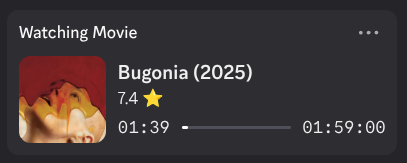
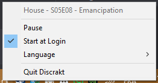

# Discrakt - Easy to Use Trakt/Plex Discord Rich Presence

<p align="center"><p>

<p align="center">
  <a href="https://github.com/afonsojramos/discrakt/actions/workflows/main.yml"></a>
  <a href="https://deps.rs/repo/github/afonsojramos/discrakt"></a>
  <a href="https://github.com/afonsojramos/discrakt/"></a>
  <a href="https://github.com/afonsojramos/discrakt/blob/main/LICENSE"></a>
</p>

A simple app that acts as a bridge between [Discord](https://discord.com/) and [Trakt](https://trakt.tv) (and maybe even [Plex](https://www.plex.tv/)), allowing for the display of the watch status as [Discord's Rich Presence](https://discord.com/rich-presence). Essentially, it's a Trakt/Plex Discord Rich Presence.

<p align="center"><p>

<p align="center"><p>

<p align="center"><p>

**How it works**: Discrakt polls your Trakt.tv account for "currently watching" status and displays it on Discord. For this to work, **your streaming app must scrobble to Trakt** — meaning it reports what you're watching to Trakt in real-time.

Popular apps with Trakt integration include:
- **Stremio** — Enable the [Trakt addon](https://www.stremio.com/addons) in Settings → Addons
- **Plex** — Use the [Plex-Trakt-Scrobbler](https://github.com/trakt/Plex-Trakt-Scrobbler) plugin
- **Kodi**, **Infuse**, **VLC** and [many more](https://trakt.tv/apps)

Once your app is scrobbling to Trakt, Discrakt will display your watch status on Discord — **wherever you are watching** (TV, phone, across the world), **in whatever app**, as long as you have a single device running **Discord** and **Discrakt**.

## Features

- Separate Discord Rich Presence apps for Movies and TV Shows
- Movie posters and show artwork displayed via TMDB
- Direct links to IMDB and Trakt pages
- Progress bar showing watch percentage
- System tray integration with pause/resume functionality
- Start at login option
- Browser-based setup wizard with OAuth device flow

Plex Rich Presence alternatives:

- [discord-rich-presence-plex](https://github.com/Phineas05/discord-rich-presence-plex)
- [plex-rich-presence](https://github.com/Ombrelin/plex-rich-presence)

## Setup

1. Run the executable
2. A setup wizard opens in your browser
3. Enter your **Trakt username** — that's it!

A default Trakt Client ID is provided, so you don't need to create your own API application.

*Note: Discord needs to be running on the same machine as Discrakt.*

<details>
<summary><strong>Advanced: Manual Configuration</strong></summary>

If you prefer to configure manually or use your own Trakt API application:

1. Create an API Application on [Trakt.tv](https://trakt.tv/oauth/applications/new) (with scrobble capabilities and `urn:ietf:wg:oauth:2.0:oob` as the redirect uri)
2. Create a `credentials.ini` file with your settings
3. Place it in one of these locations:

|Operating System|Location|Example|
|--------|-----|-------|
|Linux|`$XDG_CONFIG_HOME`/discrakt or `$HOME`/.config/discrakt|/home/alice/.config/discrakt/credentials.ini|
|macOS|`$HOME`/Library/Application Support/discrakt|/Users/Alice/Library/Application Support/discrakt/credentials.ini|
|Windows|`%APPDATA%`\discrakt|C:\Users\Alice\AppData\Roaming\discrakt\credentials.ini|

</details>

## Installation

### macOS

#### Homebrew (recommended)

```bash
brew tap afonsojramos/discrakt
brew install discrakt
```

Supports both Apple Silicon and Intel Macs.

#### DMG

Download the universal DMG from the latest [release](https://github.com/afonsojramos/discrakt/releases) and drag the app to your Applications folder.

### Windows

#### Scoop (recommended)

```powershell
scoop bucket add extras
scoop install discrakt
```

#### MSI Installer

Download the MSI installer from the latest [release](https://github.com/afonsojramos/discrakt/releases).

### Linux

#### Debian/Ubuntu (.deb)

```bash
# Download the .deb for your architecture (amd64 or arm64)
sudo dpkg -i discrakt_*_amd64.deb
```

#### Fedora/RHEL (.rpm)

```bash
# Download the .rpm for your architecture (x86_64 or aarch64)
sudo rpm -i discrakt-*.x86_64.rpm
```

#### AppImage

Download the AppImage for your architecture from the latest [release](https://github.com/afonsojramos/discrakt/releases), make it executable, and run:

```bash
chmod +x Discrakt-*-x86_64.AppImage
./Discrakt-*-x86_64.AppImage
```

### Running at Startup

Discrakt includes a "Start at Login" option in its system tray menu. Enable it to automatically start when you log in.

You can also enable autostart from the command line:

```bash
discrakt --autostart 1
```

This is useful for scripting or package manager post-install hooks. To disable:

```bash
discrakt --autostart 0
```

### Command Line Options

```
discrakt [OPTIONS]

Options:
    --autostart <VALUE>  Enable (1) or disable (0) automatic startup at login
    --version, -V        Show version information
    --help, -h           Show help message
```

## Development

Make sure you've installed Rust. You can install Rust and its package manager, `cargo` by following the instructions on [rustup.rs](https://rustup.rs/).
After installing the requirements below, simply run `cargo run`.

## Thank You

`movie` and `tv` icons by [iconixar](https://www.flaticon.com/authors/iconixar)
