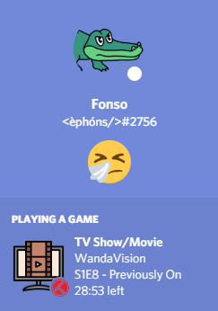
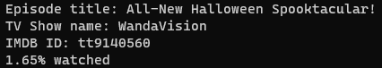

# Discrakt

A simple python script that acts as a bridge between [Discord](https://discord.com/) and [Trakt](https://trakt.tv), allowing for the display of the watch status as [Discord's Rich Presence](https://discord.com/rich-presence).

## Setup

1. Create an API Application on [Trakt.tv](https://trakt.tv/oauth/applications/new) (with scrobble capabilities) and an Application on [Discord](https://discord.com/developers/applications).
2. Edit the `credentials.ini` file with the required API keys (Cliend IDs) and Trakt username.
3. Upload images, either the ones located in `/images` or ones that you choose to submit (as long as the keys for those images stay `tv` and `movie`) to your Discord RP Art Assets in the [Developer Portal](https://discord.com/developers).
4. Run the respective executable and you're ready to start sharing your progress!

*P.S.* Discord needs to be running on the machine Discrakt is running on. 

## Running executables

Running the executables is as easy as clicking the provided executables in the latest [release](https://github.com/afonsojramos/discrakt/releases) (`.exe` for Windows and `.sh` for UNIX systems). That's it!

#### Optional:

Set the script/executable to run at startup so you don't have to worry about it again ([Windows](https://support.microsoft.com/en-us/windows/add-an-app-to-run-automatically-at-startup-in-windows-10-150da165-dcd9-7230-517b-cf3c295d89dd)/[Unix](https://raspberrypi.stackexchange.com/questions/15475/run-bash-script-on-startup))!

## Development

As usual, it is recommended to use [venv](https://docs.python.org/3/library/venv.html) and [Python 3.9](https://www.python.org/). 

After this, simply install the dependencies using `pip install -r requirements.txt`.

### Running from script

After setting things up by following the previous section, you can run this script with: `python discrakt.py`

When a show is detected throught the Trakt API, a similar output is expected in the logs:

## Thank You

`movie` and `tv` icons by [iconixar](https://www.flaticon.com/authors/iconixar)
