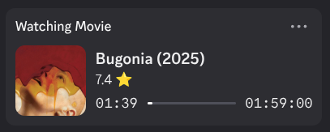
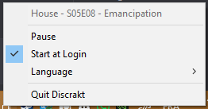

# Discrakt - Easy to Use Trakt/Plex/Jellyfin Discord Rich Presence

<p align="center"><p>

<p align="center">
  <a href="https://github.com/afonsojramos/discrakt/actions/workflows/build.yml"></a>
  <a href="https://deps.rs/repo/github/afonsojramos/discrakt"></a>
  <a href="https://github.com/afonsojramos/discrakt/"></a>
  <a href="https://github.com/afonsojramos/discrakt/blob/main/LICENSE"></a>
</p>

A simple app that acts as a bridge between [Discord](https://discord.com/) and [Trakt](https://trakt.tv), [Plex](https://www.plex.tv/), or [Jellyfin](https://jellyfin.org/), allowing for the display of the watch status as [Discord's Rich Presence](https://discord.com/rich-presence). Essentially, it's a Trakt/Plex/Jellyfin Discord Rich Presence.

<p align="center"><p>

<p align="center"><p>

<p align="center"><p>

**How it works**: Discrakt mirrors what you're watching to Discord as Rich Presence. There are two ways to connect it:

**1. Via Trakt** — works with any app that scrobbles to Trakt, so your status shows up **wherever and in whatever app you watch** (TV, phone, across the world), as long as one device is running **Discord** and **Discrakt**. Popular apps with Trakt integration:

- **Stremio** — Enable the [Trakt addon](https://www.stremio.com/addons) in Settings → Addons
- **Plex** — Use the [Plex-Trakt-Scrobbler](https://github.com/trakt/Plex-Trakt-Scrobbler) plugin
- **Kodi**, **Infuse**, **VLC** and [many more](https://trakt.tv/apps)

**2. Direct Plex or Jellyfin connection** — Discrakt connects straight to your **Plex** or **Jellyfin** server and mirrors your active session, with no Trakt account or external scrobbling needed. You log in during setup (Plex login, or Jellyfin Quick Connect) and Discrakt polls the server for what you're currently playing.

Either way, movie and show artwork plus localized titles are fetched from TMDB.

## Features

- Choose your source: **Trakt** (any app that scrobbles to it), or a direct **Plex** or **Jellyfin** server connection
- 🌐 **Multilingual support** (Automatic system detection & Tray menu selection)
  - _Localized titles for movies and episodes are fetched via TMDB._
- Separate Discord Rich Presence apps for Movies and TV Shows
- Movie posters and show artwork displayed via TMDB
- Direct link to the title's page on TMDB (IMDB as a fallback)
- Progress bar showing watch percentage
- System tray integration with pause/resume functionality
- Start at login option
- Browser-based setup wizard (Trakt login, or a direct Plex / Jellyfin connection)

## Setup

1. Run the executable
2. A setup wizard opens in your browser
3. Pick your source:
   - **Trakt**: click **Login with Trakt** and approve in your browser. (Advanced: use a public Trakt profile by username, no login.)
   - **Plex**: click **Login with Plex** and approve. (Advanced: enter a server URL + token manually.)
   - **Jellyfin**: enter your server URL and click **Login with Jellyfin**, then enter the shown code in Jellyfin's **Quick Connect**. (Advanced: use an API key.)

_Note: Discord needs to be running on the same machine as Discrakt._

<details>
<summary><strong>Advanced: Manual Configuration</strong></summary>

Discrakt creates `credentials.ini` for you during the setup wizard, so this file is **not** included in releases — you don't need to download it. Only follow these steps if you want to use your own Trakt API application:

1. Create an API Application on [Trakt.tv](https://trakt.tv/oauth/applications/new) (with scrobble capabilities and `urn:ietf:wg:oauth:2.0:oob` as the redirect uri)
2. Create a `credentials.ini` file with your settings
3. Place it in one of these locations:

| Operating System | Location                                                | Example                                                           |
| ---------------- | ------------------------------------------------------- | ----------------------------------------------------------------- |
| Linux            | `$XDG_CONFIG_HOME`/discrakt or `$HOME`/.config/discrakt | /home/alice/.config/discrakt/credentials.ini                      |
| macOS            | `$HOME`/Library/Application Support/discrakt            | /Users/Alice/Library/Application Support/discrakt/credentials.ini |
| Windows          | `%APPDATA%`\discrakt                                    | C:\Users\Alice\AppData\Roaming\discrakt\credentials.ini           |

**Using Plex instead of Trakt**: add a `[Plex]` section and select it with `[Discrakt] source = plex`:

```ini
[Discrakt]
source = plex

[Plex]
serverUrl = http://192.168.1.10:32400
token = your-x-plex-token
username = your-plex-username
```

`username` is optional and only needed to disambiguate which user's session to mirror on a shared server.

**Using Jellyfin**: add a `[Jellyfin]` section and select it with `[Discrakt] source = jellyfin`:

```ini
[Discrakt]
source = jellyfin

[Jellyfin]
serverUrl = http://192.168.1.10:8096
accessToken = your-jellyfin-api-key
username = your-jellyfin-username
```

`accessToken` can be an API key (Dashboard → API Keys) or a token from Quick Connect. When `source` is omitted, Discrakt prefers Trakt, then Plex, then Jellyfin, based on what's configured.

</details>

## Installation

### macOS

#### Homebrew (recommended)

```bash
brew tap afonsojramos/discrakt
brew install discrakt
```

Supports both Apple Silicon and Intel Macs.

#### DMG

Download the universal DMG from the latest [release](https://github.com/afonsojramos/discrakt/releases) and drag the app to your Applications folder.

### Windows

#### Winget (recommended)

```powershell
winget install afonsojramos.discrakt
```

#### Scoop

```powershell
scoop bucket add extras
scoop install discrakt
```

#### MSI Installer

Download the MSI installer from the latest [release](https://github.com/afonsojramos/discrakt/releases).

### Linux

#### Debian/Ubuntu (.deb)

```bash
# Download the .deb for your architecture (amd64 or arm64)
sudo dpkg -i discrakt_*_amd64.deb
```

#### Fedora/RHEL (.rpm)

```bash
# Download the .rpm for your architecture (x86_64 or aarch64)
sudo rpm -i discrakt-*.x86_64.rpm
```

#### AppImage

Download the AppImage for your architecture from the latest [release](https://github.com/afonsojramos/discrakt/releases), make it executable, and run:

```bash
chmod +x Discrakt-*-x86_64.AppImage
./Discrakt-*-x86_64.AppImage
```

### Running at Startup

Discrakt includes a "Start at Login" option in its system tray menu. Enable it to automatically start when you log in.

You can also enable autostart from the command line:

```bash
discrakt --autostart 1
```

This is useful for scripting or package manager post-install hooks. To disable:

```bash
discrakt --autostart 0
```

### Command Line Options

```
discrakt [OPTIONS]

Options:
    --autostart <VALUE>  Enable (1) or disable (0) automatic startup at login
    --version, -V        Show version information
    --help, -h           Show help message
```

## Development

Make sure you've installed Rust. You can install Rust and its package manager, `cargo` by following the instructions on [rustup.rs](https://rustup.rs/).
After installing the requirements below, simply run `cargo run`.

The setup wizard is a React app in [`setup-ui/`](./setup-ui) built with the [Vite+ (`vite-plus`)](https://viteplus.dev) unified toolchain (Rolldown build, oxlint, oxfmt), embedded into the binary at build time. `cargo build` runs the frontend build automatically via `build.rs`, so you also need **Node and pnpm** installed (managed by [mise](https://mise.jdx.dev): `mise install`). To iterate on the wizard UI directly, run the app once to start its local setup server, then point the dev server at it:

```bash
cd setup-ui
VITE_PROXY_TARGET=http://127.0.0.1:<setup-server-port> pnpm dev   # vp dev
pnpm lint     # oxlint via vp
pnpm format   # oxfmt via vp
```

To build the Rust binary against a prebuilt `setup-ui/dist` without invoking pnpm, set `DISCRAKT_SKIP_UI_BUILD=1`.

## Thank You

`movie` and `tv` icons by [iconixar](https://www.flaticon.com/authors/iconixar)

This product uses the TMDB API but is not endorsed or certified by [TMDB](https://www.themoviedb.org/).
